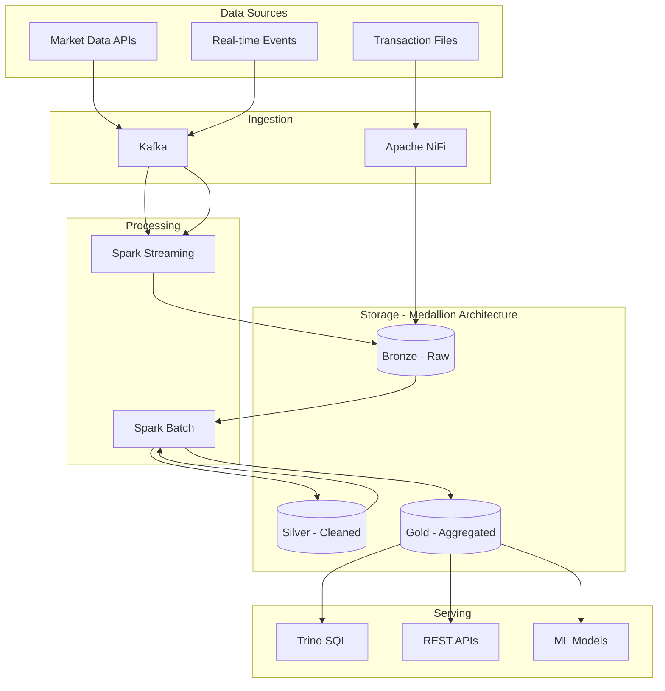

# 🚀 Financial Data Lake Platform

[](https://www.python.org/downloads/)
[](https://spark.apache.org/)
[](https://kafka.apache.org/)
[](https://www.docker.com/)
[](LICENSE)
[]()

Enterprise-grade data lake platform for real-time financial analytics, featuring streaming pipelines, ML capabilities, and cloud-native architecture.

## 🎯 Key Features

- **Real-time Processing**: Sub-second latency with Kafka and Spark Streaming
- **Scalable Architecture**: Handles millions of events per second
- **ML Platform**: Integrated MLflow for model training and deployment
- **Multi-Cloud Ready**: Runs on AWS, Azure, GCP, or on-premise
- **ACID Compliance**: Transactional guarantees with Apache Iceberg
- **Self-Service Analytics**: SQL interface via Trino for analysts

## 📊 Architecture Overview



## 🚀 Quick Start

### Prerequisites

- Docker & Docker Compose (24.0+)
- Python 3.9+
- 16GB RAM minimum
- 50GB free disk space

### 1. Clone and Setup

```bash
# Clone the repository
git clone https://github.com/Zeus797/enterprise-financial-data-lake.git
cd financial-data-lake

# Create virtual environment
python -m venv venv
source venv/bin/activate  # On Windows: venv\Scripts\activate

# Install dependencies
pip install -r requirements.txt
```

### 2. Start Infrastructure

```bash
# Start all services
make start

# Or using docker-compose directly
docker-compose up -d

# Verify services
make health-check
```

### 3. Run Your First Pipeline

```bash
# Ingest sample data
python scripts/ingest_sample_data.py

# Run batch processing
python -m src.processing.batch_pipeline

# Query the data
python scripts/query_data.py
```

### 4. Access UIs

- **MinIO Console**: http://localhost:9001 (admin/password123)
- **Spark UI**: http://localhost:8080
- **Kafka UI**: http://localhost:8081
- **Airflow**: http://localhost:8082 (airflow/airflow)
- **MLflow**: http://localhost:5000
- **Superset**: http://localhost:8088 (admin/admin)

## 📁 Project Structure

```
financial-data-lake/
├── src/                    # Source code
│   ├── ingestion/         # Data ingestion modules
│   ├── processing/        # Spark batch/stream processing
│   ├── analytics/         # Analytics and queries
│   ├── ml/               # Machine learning pipelines
│   └── common/           # Shared utilities
├── infrastructure/        # Infrastructure as Code
│   ├── docker/           # Docker configurations
│   ├── kubernetes/       # K8s manifests
│   └── terraform/        # Cloud provisioning
├── config/               # Configuration files
├── tests/                # Test suites
├── notebooks/            # Jupyter notebooks
├── docs/                 # Documentation
└── scripts/              # Utility scripts
```

## 🔧 Technologies

| Component | Technology | Purpose |
|-----------|------------|---------|
| Storage | MinIO | S3-compatible object storage |
| Processing | Apache Spark | Batch and stream processing |
| Streaming | Apache Kafka | Event streaming platform |
| Table Format | Apache Iceberg | ACID transactions, time travel |
| Query Engine | Trino | Fast SQL analytics |
| Orchestration | Apache Airflow | Workflow management |
| ML Platform | MLflow | ML lifecycle management |
| Visualization | Apache Superset | Business intelligence |
| Container | Docker/Kubernetes | Container orchestration |
| Monitoring | Prometheus/Grafana | Metrics and dashboards |

## 📈 Performance Metrics

| Metric | Current | Target |
|--------|---------|--------|
| Ingestion Throughput | 100K events/sec | 1M events/sec |
| Query Latency (p95) | <2 seconds | <1 second |
| Data Freshness | 5 minutes | 1 minute |
| Storage Efficiency | 3:1 compression | 5:1 compression |
| Pipeline Success Rate | 98% | 99.9% |

## 🧪 Testing

```bash
# Run unit tests
make test

# Run integration tests
make test-integration

# Run end-to-end tests
make test-e2e

# Generate coverage report
make coverage
```

## 📊 Sample Use Cases

- **Real-time Market Analysis**: Track stock prices with sub-second latency
- **Fraud Detection**: ML models identifying suspicious transactions
- **Risk Analytics**: Calculate VaR and other risk metrics
- **Customer 360**: Unified view of customer interactions
- **Regulatory Reporting**: Automated compliance reports

## 🤝 Contributing

We welcome contributions! Please see [CONTRIBUTING.md](CONTRIBUTING.md) for guidelines.

## 📚 Documentation

- [Architecture Guide](docs/architecture/ARCHITECTURE.md)
- [Data Flow Design](docs/architecture/DATA_FLOW.md)
- [API Reference](docs/api/README.md)
- [Development Guide](docs/development/README.md)
- [Deployment Guide](docs/deployment/README.md)
- [Troubleshooting](docs/troubleshooting/README.md)

## 🗺️ Roadmap

- ✅ Phase 1: Core infrastructure setup
- ✅ Phase 2: Streaming pipeline
- 🚧 Phase 3: Analytics layer
- ⏳ Phase 4: ML platform
- ⏳ Phase 5: Orchestration
- ⏳ Phase 6: Kubernetes deployment
- ⏳ Phase 7: Production hardening

## 📄 License

This project is licensed under the Apache License 2.0 - see [LICENSE](LICENSE) file for details.

## 🙏 Acknowledgments

- Apache Foundation for the amazing big data tools
- The open-source community for continuous support
- Cloudera for architectural inspiration

## 📞 Contact

- **LinkedIn**: [Your Profile](https://www.linkedin.com/in/david-kabera-883806247)
- **Email**: davekabera@gmail.com
- **Issues**: [GitHub Issues](https://github.com/Zeus797/financial-data-lake/issues)

---

⭐ **Star this repo if you find it helpful!**