# 📊 Progress Tracker

## Current Status: Week 1 of 12 (8.3% Complete)

```mermaid
graph LR
    subgraph "Week 1 - Foundation"
        A[✅ Day 1: Setup]
        B[🔄 Day 2: MinIO]
        C[📋 Day 3: Ingestion]
        D[📋 Day 4: Testing]
        E[📋 Day 5: CI/CD]
    end
    
    A --> B --> C --> D --> E
    
    style A fill:#90EE90
    style B fill:#FFD700
```



# 📊 Overall Progress


# 🎯 This Week's Goals — Week 1: Core Infrastructure

- Set up repository and project structure  
- Create documentation  
- Configure MinIO with bucket structure  
- Build first ingestion script  
- Add unit tests  
- Set up CI/CD  

---

## 🧾 Daily Log

### Day 1 - Monday (2024-01-15)

**Completed:**

✅ Created GitHub repository  
✅ Set up project structure  
✅ Wrote initial documentation  
✅ Created architecture design  

**Time Spent:** 2.5 hours  

**Notes:**
- Repository is public and ready  
- Architecture decisions documented  
- Ready to start coding tomorrow  

---

### Day 2 - Tuesday (2024-01-16)

**Plan:**
- Configure MinIO  
- Create bucket structure  
- Test file operations  
- Write first ingestion script  

---

## 📊 Metrics Dashboard

| Metric | Target | Current | Status |
|--------|---------|----------|--------|
| Lines of Code | 10,000 | 500 | 🔵 Starting |
| Test Coverage | 80% | 0% | 🔵 Starting |
| Services Running | 12 | 2 | 🔵 Starting |
| Data Ingested | 1M records | 0 | 🔵 Starting |

---

## 🚧 Blockers & Solutions

| Blocker | Impact | Solution | Status |
|----------|---------|-----------|--------|
| None yet | — | — | — |

---

## 🧠 Learning Notes

### Week 1 Learnings
- MinIO provides excellent S3 compatibility  
- Docker Compose simplifies local development  
- Project structure is crucial for maintainability  

---

## 🪜 Next Milestones

- **End of Week 1:** First data pipeline running  
- **End of Week 2:** Spark processing operational  
- **End of Week 4:** Real-time streaming active  
- **End of Week 8:** ML models deployed  
- **End of Week 12:** Production-ready platform  

---

## 🔗 Links & Resources

- [Project Repository](#)
- [Architecture Docs](#)
- [Development Guide](#)

---

## 🧩 Week 1 Tasks

**Create GitHub Issues for Week 1**

Create file: `scripts/create_github_issues.py`

```python
#!/usr/bin/env python3
"""
Create GitHub issues for project tracking
Run: python scripts/create_github_issues.py
"""

import json
import subprocess

# Week 1 Issues
week_1_issues = [
    {
        "title": "Week 1: Set up development environment",
        "body": """
## Objective
Set up complete development environment for the data lake project

## Tasks
- [ ] Install Docker Desktop
- [ ] Set up Python 3.9+ virtual environment
- [ ] Install required dependencies
- [ ] Configure VS Code with extensions
- [ ] Test docker-compose setup

## Success Criteria
- All services start successfully
- Can run basic Python scripts
- MinIO UI accessible at localhost:9001

## Time Estimate: 2 hours
        """,
        "labels": ["week-1", "setup", "priority-high"]
    },
    {
        "title": "Week 1: Configure MinIO storage layer",
        "body": """
## Objective
Set up MinIO with proper bucket structure for medallion architecture

## Tasks
- [ ] Create bronze, silver, gold buckets
- [ ] Configure access policies
- [ ] Test file upload/download
- [ ] Create folder structure
- [ ] Document S3 endpoints

## Success Criteria
- All three buckets created
- Can upload/download files via Python
- Proper folder hierarchy established

## Time Estimate: 2 hours
        """,
        "labels": ["week-1", "infrastructure", "priority-high"]
    },
    {
        "title": "Week 1: Build market data ingestion",
        "body": """
## Objective
Create Python script to ingest market data from Yahoo Finance

## Tasks
- [ ] Create data ingestion module
- [ ] Implement Yahoo Finance API client
- [ ] Add error handling and retries
- [ ] Store raw data in bronze layer
- [ ] Add logging and monitoring

## Code Location
`src/ingestion/market_data.py`

## Success Criteria
- Successfully ingest data for 5+ stocks
- Data stored in bronze/market-data/
- Handles API errors gracefully

## Time Estimate: 3 hours
        """,
        "labels": ["week-1", "ingestion", "feature"]
    },
    {
        "title": "Week 1: Add unit tests",
        "body": """
## Objective
Create comprehensive unit tests for ingestion module

## Tasks
- [ ] Set up pytest configuration
- [ ] Create tests for data validation
- [ ] Test error handling
- [ ] Mock external API calls
- [ ] Add test coverage reporting

## Success Criteria
- 80%+ code coverage
- All tests passing
- CI runs tests automatically

## Time Estimate: 2 hours
        """,
        "labels": ["week-1", "testing", "quality"]
    },
    {
        "title": "Week 1: Set up CI/CD pipeline",
        "body": """
## Objective
Create GitHub Actions workflow for continuous integration

## Tasks
- [ ] Create .github/workflows/ci.yml
- [ ] Add linting checks (black, flake8)
- [ ] Run unit tests on PR
- [ ] Add code coverage badge
- [ ] Set up pre-commit hooks

## Success Criteria
- CI runs on every push/PR
- Blocks merge if tests fail
- Coverage report generated

## Time Estimate: 2 hours
        """,
        "labels": ["week-1", "devops", "automation"]
    }
]

def create_issue(issue_data):
    """Create a single GitHub issue"""
    cmd = [
        "gh", "issue", "create",
        "--title", issue_data["title"],
        "--body", issue_data["body"]
    ]
    
    for label in issue_data["labels"]:
        cmd.extend(["--label", label])
    
    try:
        result = subprocess.run(cmd, capture_output=True, text=True)
        if result.returncode == 0:
            print(f"✅ Created: {issue_data['title']}")
        else:
            print(f"❌ Failed: {issue_data['title']}")
            print(result.stderr)
    except Exception as e:
        print(f"Error creating issue: {e}")

if __name__ == "__main__":
    print("Creating GitHub issues for Week 1...")
    
    # First create labels
    labels = [
        ("week-1", "0E8A16", "Week 1 tasks"),
        ("week-2", "1E90FF", "Week 2 tasks"),
        ("setup", "FBCA04", "Environment setup"),
        ("infrastructure", "006B75", "Infrastructure work"),
        ("ingestion", "5319E7", "Data ingestion"),
        ("testing", "F9D0C4", "Testing tasks"),
        ("devops", "C5DEF5", "DevOps and CI/CD"),
        ("priority-high", "D93F0B", "High priority"),
        ("feature", "A2EEEF", "New feature"),
        ("quality", "F9D0C4", "Code quality"),
    ]
    
    for label, color, desc in labels:
        subprocess.run([
            "gh", "label", "create", label,
            "--color", color,
            "--description", desc
        ])
    
    # Create issues
    for issue in week_1_issues:
        create_issue(issue)
    
    print("\n✅ All issues created! Check your GitHub repo.")
```
