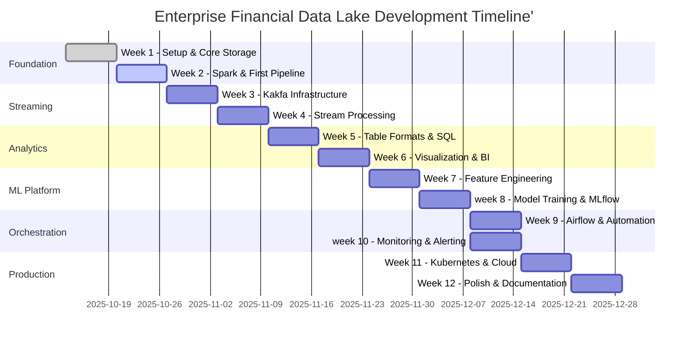

# 📅 12-Week Development Timeline

## Overview

Building this data lake in 12 weeks working evenings/weekends (~15 - 20 hours/week).



## Phase 1: Foundation(Weeks 1-2)

### Week1: Core Infrastructure
**Goal:** Get storage layer working with basic ingestion

**Daily Beakdown**
```yaml
Monday (2 hours):
    - Set up repository and development environemnt
    - Create project structure
    - Write Initial Documentation

Tuesday (2 hours):
    - Configure MinIO with proper bucket structure
    - Create data zones (bronze/silver/gold) 
    - Test file upload/download

Wednesday (2 hours):
    - Build first Python ingestion script
    - Implement error handling and logging
    - Create configuration management

Thursday (2 hours):
    - Add data validation
    - Implement retry logic
    - Create unit tests

Friday (2 hours):
    - Set up Github  Actions CI
    - Add pre-commit hooks
    - Document setup process

Weekend (5-6 hours):
    - Build market data ingestion from Yahoo Finance API
    - Create scheduled ingestion
    - Add monitoring/alerting basics
    - Write Week 1 blog post
```

**Deliverables:**

✅ Working MinIO setup with bronze/silver/gold buckets
✅ Python scripts for data ingestion
✅ Basic CI/CD pipeline
✅ 500+ lines of tested code

**Success Metrics**
```python
# You can verify success with:
- successfully ingest 1000+ records
- All tests passing (pytest)
- Data visible in MinIO console
- Automates ingestion running every 30 minutes
```

### Week 2: Apache Spark & Batch Processing
**Goal:** Process data from bronze to silver layer

**Daily Breakdown:**
```yaml
Monday (2 hours):
    - Add Spark to docker compose
    - Implement data cleaning transformations
    - Handle schema evolution

Tuesday (2 hours):
    - Create first Spark job (bronze -> silver)
    - Implement data cleaning transformations
    - Handle schema evolution

Wednesday (2 hours):
    - Add data quality checks (null, duplicates, ranges)
    - Implement partitioning strategy
    - Optimize file formats (Parquet)

Thursday (2 hours):
    - Create aggregation jobs (silver -> gold)
    - Build business metrics
    - Add performance optimization

Friday (2 hours):
    - Unit test spark jobs
    - Add intergration tests
    - Document Spark patterns

Weekend (5-6 hours):
    - Build complete ETL pipeline
    - Add scheduling with cron
    - Performance tuning
    - Create Jupyter notebooks for analysis

```

**Learning Resources:**
```markdown

- **Spark Basics**: http://spark.apache.org/docs/latest/quick-start.html
- **Pyspark Tutorial**: Datacamp Pyspark course (3 hours)
- **Book**: "Learning Spark" - Chapters 1-4
- **Videos**: Databricks YouTube - Spark Basics playlist
```

**Code Example for Week 2:**

```python
# src/processing/bronze_to_silver.py
from pyspark.sql import SparkSession
from pyspark.sql.functions import *
from datetime import datetime

def create_spark_session():
    return SparkSession.builder \
        .appName("BronzeToSilver") \
        .config("spark.hadoop.fs.s3a.endpoint", "http://localhost:9000") \
        .config("spark.hadoop.fs.s3a.access.key", "admin") \
        .config("spark.hadoop.fs.s3a.secret.key", "password123") \
        .config("spark.hadoop.fs.s3a.path.style.access", "true") \
        .getOrCreate()
def bronze_to_silver(date_str: str):
    spark = create_spark_session()
    
    # Read from bronze
    bronze_df = spark.read.json(f"s3a://bronze/market-data/date={date_str}/")
    
    # Clean and transform
    silver_df = bronze_df \
        .dropDuplicates(["symbol", "timestamp"]) \
        .filter(col("price") > 0) \
        .filter(col("volume") > 0) \
        .withColumn("processed_at", current_timestamp()) \
        .select(
            "symbol",
            to_timestamp("timestamp").alias("timestamp"),
            col("price").cast("decimal(10,2)").alias("price"),
            col("volume").cast("bigint").alias("volume"),
            "processed_at"
        )
    
    # Write to silver
    silver_df.write \
        .mode("overwrite") \
        .partitionBy("symbol") \
        .parquet(f"s3a://silver/market-data/date={date_str}/")
    
    print(f"✅ Processed {silver_df.count()} records for {date_str}")

if __name__ == "__main__":
    bronze_to_silver("2024-01-15")
```

## Phase 2: Streaming (Weeks 3-4)

### Week 3: Kafka Setup & Producers

**Goal:** Real-time data ingestion with Kafka

**Daily Tasks:**

```yaml
Monday:
  - Add Kafka & Zookeeper to docker-compose
  - Install Kafka UI for monitoring
  - Create initial topics

Tuesday:
  - Build Kafka producer for market data
  - Implement Avro serialization
  - Add Schema Registry

Wednesday:
  - Create producer for transaction events
  - Add error handling and retries
  - Implement dead letter queue

Thursday:
  - Build Kafka consumers
  - Add consumer groups
  - Implement offset management

Friday:
  - Test throughput (target: 10K msgs/sec)
  - Add monitoring metrics
  - Document Kafka patterns

Weekend:
  - Build real-time dashboard
  - Add multiple data sources
  - Performance optimization
  - Integration testing

```

**Key Concepts to Learn:**
- Kafka architecture (brokers, topics, partitions)
- Producer/Consumer patterns
- Exactly-once semantics
- Schema Registry and Avro

### Week 4: Spark Structured Streaming

**Goal**: Process streaming data in real-time

**Implementation Focus:**

```python
# Streaming pipeline example
def create_streaming_job():
    spark = create_spark_session()
    
    # Read from Kafka
    kafka_df = spark.readStream \
        .format("kafka") \
        .option("kafka.bootstrap.servers", "localhost:9092") \
        .option("subscribe", "market-data") \
        .option("startingOffsets", "latest") \
        .load()
    
    # Process stream
    processed_df = kafka_df \
        .select(from_json(col("value").cast("string"), schema).alias("data")) \
        .select("data.*") \
        .groupBy(
            window(col("timestamp"), "1 minute"),
            col("symbol")
        ) \
        .agg(
            avg("price").alias("avg_price"),
            sum("volume").alias("total_volume"),
            count("*").alias("trade_count")
        )
    
    # Write to silver layer
    query = processed_df.writeStream \
        .outputMode("append") \
        .format("parquet") \
        .option("path", "s3a://silver/streaming/") \
        .option("checkpointLocation", "/tmp/checkpoint") \
        .trigger(processingTime="30 seconds") \
        .start()
    
    return query
```

## Phase 3: Analytics (Weeks 5-6)

### Week 5: Table Formats & SQL Engine
**Goal**: Enable SQL analytics with Iceberg and Trino

**Tasks:**
- Implement Apache Iceberg for ACID transactions
- Deploy Trino for SQL queries
- Create table catalogs
- Build materialized views
- Optimize query performance

**Learning Path:**

```markdown
1. Apache Iceberg basics (2 hours)
2. Trino fundamentals (3 hours)
3. SQL optimization techniques (2 hours)
4. Partition pruning strategies (1 hour)
```

### Week 6: Visualization & BI

**Goal**: Self-service analytics for business users

**Components**:

- Deploy Apache Superset
- Create 5 key dashboards
- Set up Jupyter Hub
- Build data catalog
- Document metrics definitions

## Phase 4: ML Platform (Weeks 7-8)

### Week 7: Feature Engineering

**Goal**: Build feature store for ML

**Implementation:**

```python
# Feature engineering pipeline
def create_features():
    # Technical indicators
    features = df.withColumn("sma_20", 
        avg("price").over(Window.partitionBy("symbol").orderBy("timestamp").rowsBetween(-19, 0))
    )
    
    # Price momentum
    features = features.withColumn("momentum",
        (col("price") - lag("price", 5).over(Window.partitionBy("symbol").orderBy("timestamp"))) / lag("price", 5).over(Window.partitionBy("symbol").orderBy("timestamp"))
    )
    
    # Volatility
    features = features.withColumn("volatility",
        stddev("price").over(Window.partitionBy("symbol").orderBy("timestamp").rowsBetween(-20, 0))
    )
    
    return features
```

### Week 8: MLflow & Model Training
**Goal**: Train and deploy ML models

**Models to Build:**
1. Stock price prediction (LSTM)
2. Fraud detection (XGBoost)
3. Customer segmentation (K-Means)
4. Anomaly detection (Isolation Forest)

## Phase 5: Orchestration (Weeks 9-10)

### Week 9: Apache Airflow
**Goal**: Automate all pipelines

**DAGs to Create:**
```python
# Daily batch processing DAG
@dag(
    schedule="0 2 * * *",
    start_date=datetime(2024, 1, 1),
    catchup=False
)
def daily_batch_pipeline():
    
    @task
    def ingest_data():
        # Ingest from sources
        pass
    
    @task
    def process_bronze_to_silver():
        # Run Spark job
        pass
    
    @task
    def process_silver_to_gold():
        # Create aggregates
        pass
    
    @task
    def train_models():
        # Retrain ML models
        pass
    
    # Define dependencies
    ingest_data() >> process_bronze_to_silver() >> process_silver_to_gold() >> train_models()
```

### Week 10: Monitoring & Alerting
**Goal**: Production-grade observability

**Stack:**
- Prometheus for metrics
- Grafana for dashboards
- AlertManager for alerts
- ELK for logs

## Phase 6: Production (Weeks 11-12)

### Week 11: Kubernetes Deployment
**Goal**: Container orchestration

**Tasks**:
- Containerize all services
- Create Helm charts
- Deploy to Minikube
- Implement GitOps with ArgoCD
- Add horizontal pod autoscaling

### Week 12: Polish & Documentation
**Goal**: Production-ready project

**Final Sprint:**

```yaml
Monday-Tuesday:
  - Performance testing with JMeter
  - Security scanning
  - Cost optimization

Wednesday-Thursday:
  - Complete documentation
  - Create video demo
  - Write blog series

Friday-Sunday:
  - Final testing
  - Create presentation
  - Share on social media
  - Submit to newsletters
```

## Success Criteria by Week

| **Week** | **Success Metric**                 | **How to Verify**                     |
|------|--------------------------------|-----------------------------------|
| 1    | Ingest 10K records             | `SELECT COUNT(*) FROM bronze.raw` |
| 2    | Process 100K records with Spark| Check silver layer files          |
| 3    | Stream 1K msgs/sec             | Kafka UI metrics                  |
| 4    | <1 min data freshness          | Dashboard real-time updates       |
| 5    | <2 sec query response          | Trino query benchmarks            |
| 6    | 5 working dashboards           | Superset UI                       |
| 7    | 20+ features engineered        | Feature store count               |
| 8    | 3 models deployed              | MLflow registry                   |
| 9    | 5 automated DAGs               | Airflow UI                        |
| 10   | 99% pipeline success rate      | Monitoring dashboards             |
| 11   | Kubernetes deployment          | `kubectl get pods`                |
| 12   | 100+ GitHub stars              | GitHub repo metrics               |

# 📘 Learning Schedule

## Weekly Learning Time (5 hours/week)

| Day       | Duration | Focus Area                 |
|------------|-----------|----------------------------|
| Monday     | 1 hour    | Video tutorials            |
| Tuesday    | 1 hour    | Documentation reading      |
| Wednesday  | 1 hour    | Hands-on practice          |
| Thursday   | 1 hour    | Blog/article reading       |
| Friday     | 1 hour    | Community forums / Discord |

---

## Key Resources by Phase

### 🧱 Foundation (Weeks 1–2)
- **Course:** “Data Engineering with Python” – DataCamp  
- **Book:** *Designing Data-Intensive Applications* – Martin Kleppmann  
- **Videos:** “Data Engineering Basics” – Seattle Data Guy  

### 🔄 Streaming (Weeks 3–4)
- **Course:** “Apache Kafka for Beginners” – Udemy  
- **Book:** *Kafka: The Definitive Guide*  
- **Docs:** Confluent Kafka tutorials  

### 📊 Analytics (Weeks 5–6)
- **Course:** “SQL for Data Analysis” – Mode Analytics  
- **Book:** *The Data Warehouse Toolkit*  
- **Videos:** Apache Iceberg talks (Subsurface)  

### 🤖 ML Platform (Weeks 7–8)
- **Course:** “MLOps Fundamentals” – Coursera  
- **Book:** *Building Machine Learning Pipelines*  
- **Docs:** MLflow tutorials  

### ⚙️ Production (Weeks 9–12)
- **Course:** “Kubernetes for Developers” – Linux Foundation  
- **Book:** *Site Reliability Engineering* – Google  
- **Videos:** “GitOps with ArgoCD” – YouTube  

---

# ⚠️ Risk Management

## Potential Blockers & Mitigations

| Risk                     | Impact | Mitigation |
|---------------------------|---------|-------------|
| Spark learning curve      | High    | Start with simple transformations; use ChatGPT for help |
| Kafka complexity          | Medium  | Use Kafka UI; start with a single partition |
| Time constraints           | High    | Focus on MVP; skip ML temporarily if needed |
| Kubernetes difficulty     | Medium  | Use `docker-compose` for demos if K8s fails |
| Integration issues        | Medium  | Test each component in isolation first |

---

# 📆 Tracking Progress

## 🗓️ Daily Standup Template

```markdown
## Date: [YYYY-MM-DD]

### Completed Today:
- [ ] Task 1
- [ ] Task 2

### Blockers:
- None / Description

### Tomorrow's Plan:
- [ ] Task 1
- [ ] Task 2

### Learning:
- Key insight or new skill

### Metrics:
- Lines of code: X
- Tests written: Y
- Documentation pages: Z

# 📈 Weekly Review Template

## Week [N] Review

### Achievements:
- ✅ Goal 1
- ✅ Goal 2
- ⏳ Goal 3 (partial)

### Metrics:
- Code coverage: X%
- Pipeline success rate: Y%
- Performance: Z records/sec

### Learnings:
- Technical insight
- Process improvement

### Next Week Focus:
- Priority 1
- Priority 2
